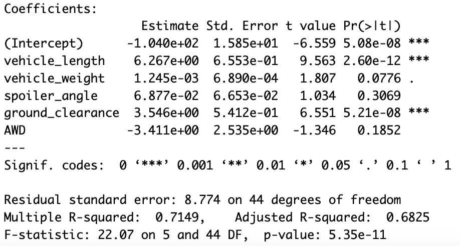
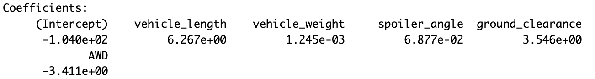
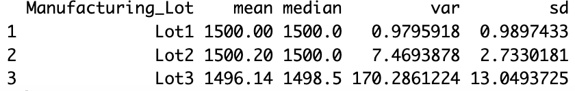
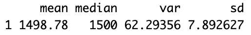
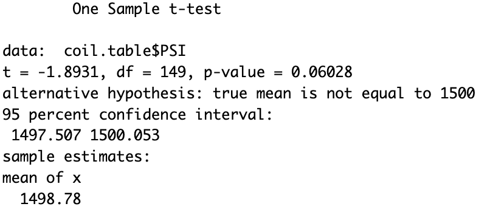
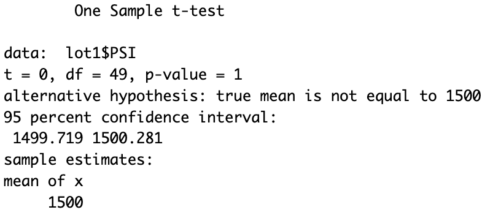
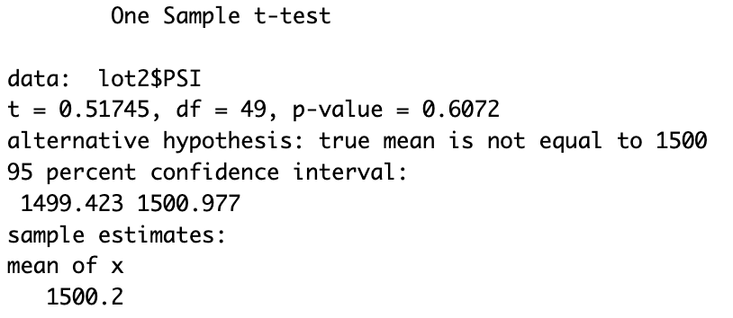
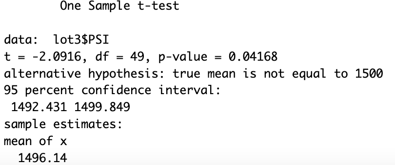

# MechaCar_Statistical_Analysis

## Linear Regression to Predict MPG
1) Vehicle length and ground clearance provided a non-random amount of variance to the mpg values in the dataset. We know this because the p-values for vehicle length and ground clearance are less than 0.05 while the p-values for the other variables are greater than 0.05. This means vehicle length and grounhd clearance do have a significant impact on mpg. 

2) The slope of the linear model is not considered to be zero. We know this because the p-value of the hypothesis is less than 0.05 so the model is significant.

3) The model has an multiple R-squared value of 0.7149. This means that this model has a 71% variance in predicted mpg values. Although clearly not perfect this level of accuracy is considered to be relatively effective. 

### Total Summary

### Summary by Lot

## T-Tests on Suspension Coils
In the t-test across all lots we see a p-value of 0.06. This is greater than 0.05 which means we cannot reject the null hypothesis. This tells us that the mean PSI across all lots is statistically similar to the population mean of 1,500.

In the t-tests run on lots 1 and 2, we get a similar result. The p-value from the t-test run on lot 1 was equal to 1 which means lot 1's average PSI was more statistically similar to the population mean than any other lot. A t-test run on lot 3 however, yields a different result with a p-value of 0.04. This is less than 0.05 so in this case, we can reject the null hypothesis. This tells us that lot 3's mean PSI is significantly different than the population mean. It would most certainly be worth looking into what went wrong with lot 3 and how to fix the problem. 

## Study Design: MechaCar vs Competition
Especially with rising gas prices, fuel efficiency has certainly become an important consideration when it comes to purchasing a car. For this reason, it would make sense to conduct a study comparing the fuel efficiency of MechaCar to the fuel efficiency of competitors. The null hypothesis of such a study would be that there is no statistically significant difference between MechaCar's fuel efficiency and that of it's competitors. The alternative hypothesis would be that there is a statistical difference between MechaCar's fuel efficiency and that of it's competitors. For this study, we would conduct a one-sample t-test using data from a sample of MechaCars and a sample of competitor cars. 

